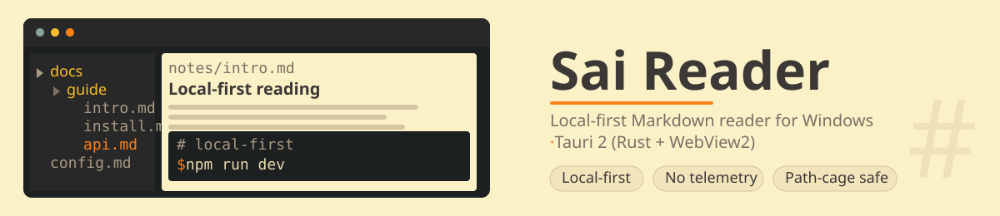
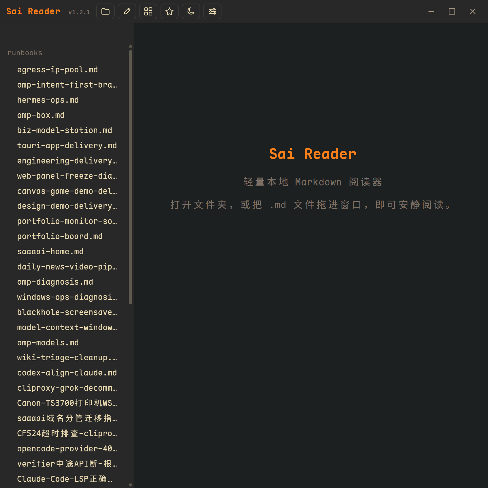

<div align="center">

**🌐 作者 [Sai](https://saaaai.com) · 个人主页 [saaaai.com](https://saaaai.com)** — AI 工作流与开源

**[English](README.md) · [简体中文](README.zh-CN.md) · [日本語](README.ja.md)**

</div>

# Sai Reader



一款面向 Windows 的本地优先 Markdown 阅读器，基于 Tauri 2（Rust + WebView2）构建。快速、私密、完全离线 —— 你的笔记永远不会离开你的设备。

## 功能特性

- **多根目录文库** — 将多个本地文件夹注册为文档根目录；通过侧边栏文件树（含目录大纲）浏览每个文库
- **本地优先 & 私密** — 纯文件系统访问，带路径围栏（path-cage）；无云端、无遥测、无账号
- **完整的 Markdown 渲染** — 通过 [marked](https://github.com/markedjs/marked) 渲染 GitHub 风格 Markdown，通过 [KaTeX](https://github.com/KaTeX/KaTeX) 渲染数学公式，通过 [highlight.js](https://github.com/highlightjs/highlight.js) 实现代码高亮
- **内置编辑器** — 就地编辑任意文档并保存回磁盘
- **主题** — 浅色/深色主题切换，自定义强调色
- **在终端中打开** — 在当前文库根目录启动外部终端
- **原生安装包** — 由 Tauri 生成的 NSIS + MSI 安装包

## 截图



上方 hero 已预览实际外观 —— 侧边栏文件树、纸质阅读页与代码块，均以应用自身的配色绘制。完整窗口截图将稍后补充。

## 环境要求

- Windows 10/11（WebView2 运行时，现代 Windows 默认已安装）
- [Rust](https://rustup.rs/)（stable 工具链）
- [Node.js](https://nodejs.org/) 18+

## 从源码构建

```powershell
npm install
npm run dev       # 带热重载的开发构建
npm run build     # 发布构建 → NSIS/MSI 安装包位于 src-tauri/target/release/bundle/
```

无需单独的前端构建步骤：前端位于 `ui-reader/`，直接内嵌。

## 架构

前端（`ui-reader/`）是纯 HTML/CSS/JS 单页应用。Rust 后端（`src-tauri/`）暴露了一个小而能力受限的 IPC 接口：

| 命令 | 说明 |
|---|---|
| `desktop_info` | 应用版本 / 平台信息 |
| `pick_folder` | 选择文库根目录文件夹 |
| `list_md_tree` | 列出根目录下的 `.md` 文件（按名称 + mtime 排序） |
| `read_text` | 读取文件（受路径围栏约束） |
| `load_roots` / `save_roots` | 持久化已注册的文库根目录（应用配置目录中的 `roots.json`） |
| `open_in_terminal` | 在已注册的根目录启动外部终端 |

### 安全模型

- **路径围栏（Path cage）**：每次文件读取都会规范化根目录，并拒绝任何逃逸出根目录的路径
- **最小权限**：IPC 权限在 `src-tauri/capabilities/default.json` 中声明；WebView 没有任何网络访问权限
- **不内嵌 shell**：终端以独立 OS 进程打开；WebView 永不持有 PTY

## 第三方声明

参见 [THIRD_PARTY_NOTICES.md](THIRD_PARTY_NOTICES.md) 了解打包进前端库的详情。

## 许可证

[MIT](LICENSE) © 2026 nakamotosai

## 状态与进度（进度主文件 · 2026-08-08 补节）

> 追踪规则：`skill://sai-long-project` + `skill://sai-closeout`；长流水见 `progress.md`；项目本卡 vps `~/project-portfolio/projects.md`。

- **状态**：暂时完结（2026-08-06 暂收口）
- **最新**：v1.2.1 已发（拖动/性能已修·GH Release·主页开源已上·reviewer 8/8）
- **残差**：①第一屏黑/编辑遮挡 ②版本号 ③透明度 ④背景色 go ⑤工具栏两模式 ⑥覆盖+版号自动
- **唯一 next**：等用户反馈后复核残差
- **双仓**：GitHub（SSOT）+ Gitea（备份）双端同 HEAD（核 `git ls-remote`）

---

镜像：[GitHub](https://github.com/nakamotosai/sai-md-reader) · Gitea（自托管）
